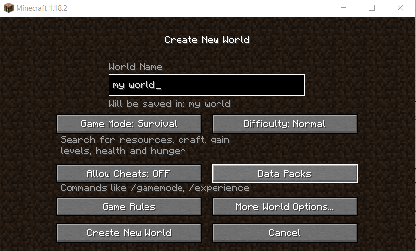

```{r globaloptions, include = FALSE}
knitr::opts_chunk$set(
  message = FALSE,
  warning = FALSE,
  comment = NA
)
```

#  {.tabset .tabset-pills}

## Main

### MineCraft

Explore a new world with Minecraft, Survive in a world where you where you can make or create anything you want! this page is a help page to show new Users how to download and start playing minecraft today


### What is MineCraft?

Minecraft is a online game on multiple platforms such as PC, Xbox and PlayStation. It a sandbox game which gives users the ability to play or create anything they want. Minecraft was released in 2011 and was created by Marcus "Notch" Persson.

### Download

You an purchase and download Minecraft for PC [Here](https://www.minecraft.net/en-us/store/minecraft-windows10).

[Click here](#how-to-download) for how to Download

### Getting Started {#getting-started}

If you've already downloaded Minecraft [Click Here](#getting-started).

### Help

If you need help you can contact me at [huntleyls@appstate.edu](mailto:huntleyls@appstate.edu){.email}

You can find help from other people in the Minecraft community [Here.](https://www.minecraftforum.net/){target="blank"}

Also, you can get direct help [Here.](https://help.minecraft.net/hc/en-us){target="blank"}

<hr>

## How To Download {#how-to-download}

### Step 1

Follow this link [Here](https://www.minecraft.net/en-us/store/minecraft-windows10).

Click On Buy!


### Step 2

Create a Mojang acount on the Minecraft Website.


### Step 3

Input a payment method and purchase MineCraft.


### Step 4

Click the Download button.


### Step 5

Run the MinecraftInstaller.exe File.


### Step 6

Follow the instructions and let it download.


### Finished Downloading

You have downloaded Minecraft!!


Click the Getting Started tab to learn how to start playing MineCraft.

<hr>

## Getting Started

### Login to Minecraft


### Click The Play Button


### Click Single player


### Click Create New World

* Name Your World.
* Click Creative or Survival 
* Click Create New World.



### Start Playing!!


<hr>

## Minecraft Keyboard Controls

**This is the Basic Controls for Minecraft**


## Author

### Luke Huntley

**About**

I am a Junior Computer Science major at Appalachian State University. This is my Documentation project for my Technical Writing course.

**Contact**
You can contact me at [huntleyls@appstate.edu](mailto:huntleyls@appstate.edu){.email}


<hr>
